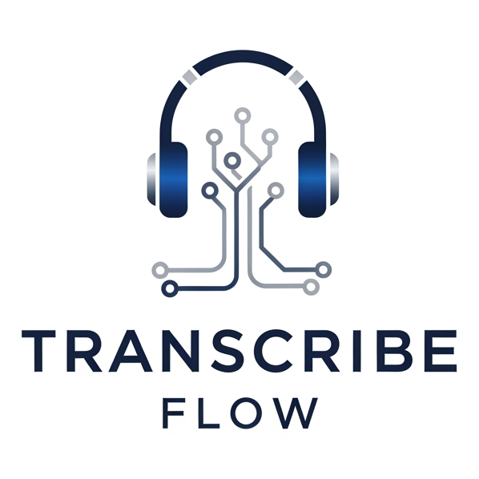
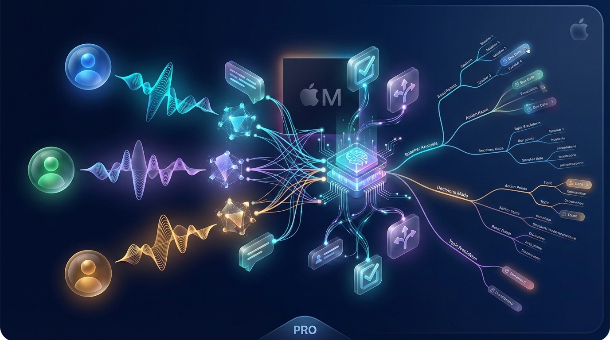

<p align="center">
  
</p>



<p align="center">
  <a href="./README.md"></a>
  <a href="./README.ru.md"></a>
</p>

> **Локальная AI-транскрипция встреч с определением спикеров и интеллектуальным анализом — оптимизировано для Apple Silicon.**

Превратите аудиозаписи в структурированные, практически применимые знания без отправки данных в облако.

---

## Быстрый старт (5 шагов)

```
┌───────────────────────────────────────────────────────────────────────────┐
│  1. Клонировать  →  2. Настроить  →  3. Запустить  →  4. Открыть  →  5. Готово  │
└───────────────────────────────────────────────────────────────────────────┘
```

### Шаг 1: Клонирование репозитория
```bash
git clone https://github.com/Serg1kk/transcribeflow.git
cd transcribeflow
```

### Шаг 2: Получение токена HuggingFace
1. Создайте аккаунт на [huggingface.co](https://huggingface.co)
2. Перейдите в [Settings → Tokens](https://huggingface.co/settings/tokens) → Создать токен
3. Примите лицензию на [pyannote/speaker-diarization-3.1](https://huggingface.co/pyannote/speaker-diarization-3.1)

> **Примечание:** При первом запуске могут появиться ошибки доступа к моделям. Вам нужно посетить страницы этих моделей на HuggingFace и нажать "Agree" для принятия лицензий (однократная операция):
> - [pyannote/speaker-diarization-3.1](https://huggingface.co/pyannote/speaker-diarization-3.1)
> - [pyannote/segmentation-3.0](https://huggingface.co/pyannote/segmentation-3.0)

### Шаг 3: Настройка и запуск
```bash
cp .env.example .env
# Отредактируйте .env → добавьте ваш HF токен: TRANSCRIBEFLOW_HF_TOKEN=hf_xxx

./start.sh
```

### Шаг 4: Открытие в браузере
```
Фронтенд:    http://localhost:3000  (точный порт показан в консоли)
Бэкенд:      http://localhost:8000
API документация:  http://localhost:8000/docs
```

### Шаг 5: Загрузка и транскрипция
Перетащите аудио → Дождитесь обработки → Получите транскрипт со спикерами!

---

## Важные замечания

### Нет Apple Silicon? Используйте облачную транскрипцию

Локальная транскрипция с MLX Whisper требует **Apple Silicon Mac (M1/M2/M3/M4)**.

Если у вас:
- Windows/Linux
- Intel Mac
- Старое/слабое оборудование

Вы можете использовать **облачных провайдеров транскрипции**:

| Провайдер | Описание | Настройка |
|-----------|----------|-----------|
| **ElevenLabs** | Высококачественное распознавание | Получите API ключ на [elevenlabs.io](https://elevenlabs.io) |
| **Deepgram** | Быстрое и точное | Получите API ключ на [deepgram.com](https://deepgram.com) |
| **AssemblyAI** | Богатый функционал | Получите API ключ на [assemblyai.com](https://assemblyai.com) |
| **Yandex SpeechKit** | Отлично для русского | Получите API ключ на [cloud.yandex.ru](https://cloud.yandex.ru) |

Добавьте API ключ на странице Настроек или в файле `.env`, затем выберите провайдера при загрузке.

### API ключи LLM для постобработки

Для использования **LLM постобработки** (очистки) и **AI-анализа** нужен API ключ:

| Провайдер | Как получить | Стоимость |
|-----------|--------------|-----------|
| **Google Gemini** (рекомендуется) | [aistudio.google.com](https://aistudio.google.com) → Get API Key | Есть бесплатный тариф |
| **OpenRouter** | [openrouter.ai](https://openrouter.ai) → Keys | Оплата по использованию, много моделей |

Добавьте ключ на странице **Настроек** после запуска приложения.

---

## Конвейер обработки

```
┌──────────────────────────────────────────────────────────────────────────────┐
│                           КОНВЕЙЕР TRANSCRIBEFLOW                             │
├──────────────────────────────────────────────────────────────────────────────┤
│                                                                              │
│   ┌─────────┐    ┌─────────────┐    ┌─────────────┐    ┌─────────────────┐  │
│   │  АУДИО  │───▶│   WHISPER   │───▶│   PYANNOTE  │───▶│   ТРАНСКРИПТ    │  │
│   │  ФАЙЛ   │    │  (MLX ASR)  │    │  (СПИКЕРЫ)  │    │   + СПИКЕРЫ     │  │
│   └─────────┘    └─────────────┘    └─────────────┘    └────────┬────────┘  │
│                                                                  │           │
│                     ПОСТОБРАБОТКА УРОВНЯ 1                       ▼           │
│                  ┌───────────────────────────────────────────────────────┐   │
│                  │  LLM ОЧИСТКА: Исправление ошибок ASR, объединение     │   │
│                  │  фрагментов, идентификация спикеров, удаление слов-   │   │
│                  │  паразитов                                            │   │
│                  └───────────────────────────────────────────────────────┘   │
│                                                                  │           │
│                         AI-АНАЛИЗ УРОВНЯ 2                       ▼           │
│                  ┌───────────────────────────────────────────────────────┐   │
│                  │  СТРУКТУРИРОВАННОЕ ИЗВЛЕЧЕНИЕ: Задачи, решения,       │   │
│                  │  блокеры, ключевые моменты + интерактивная MINDMAP    │   │
│                  └───────────────────────────────────────────────────────┘   │
│                                                                              │
└──────────────────────────────────────────────────────────────────────────────┘
```

---

## Возможности

### Базовая транскрипция
| Функция | Описание |
|---------|----------|
| **100% локально** | Вся обработка на вашем Mac — данные не покидают устройство |
| **MLX Whisper** | ASR, оптимизированный для Apple Silicon (M1/M2/M3/M4) |
| **Облачное ASR** | ElevenLabs, Deepgram, AssemblyAI, Yandex (для не-Apple устройств) |
| **Диаризация** | Pyannote Audio 3.1 определяет, кто что сказал |
| **Система очередей** | Загружайте несколько файлов, обработка в фоне |
| **Множество форматов** | MP3, M4A, WAV, OGG, FLAC, WebM |

### LLM постобработка (Уровень 1)
| Функция | Описание |
|---------|----------|
| **Очистка ASR** | Исправление ошибок транскрипции с помощью LLM |
| **Идентификация спикеров** | LLM определяет имена и/или роли из контекста (например, "Продавец и Клиент", "Разработчик и Дизайнер"). Предложения отображаются в UI — применяйте, отклоняйте или редактируйте |
| **Объединение фрагментов** | Склейка разорванных предложений |
| **Режим сравнения** | Сравнение оригинала и очищенной версии бок о бок |
| **Система шаблонов** | IT-совещание, Звонок продаж, Интервью |

### AI-анализ (Уровень 2)
| Функция | Описание |
|---------|----------|
| **Структурированное извлечение** | Задачи, решения, блокеры, ключевые моменты |
| **Интерактивная Mindmap** | Визуальный обзор встречи с markmap.js |
| **6 шаблонов** | IT-совещание, Звонок продаж, Бизнес-встреча, Интервью, Ретроспектива, Мозговой штурм |
| **Источник: оригинал/очищенный** | Генерация анализа из сырого или очищенного транскрипта |

### LLM провайдеры
| Провайдер | Модели |
|-----------|--------|
| **Google Gemini** | gemini-2.5-flash, gemini-2.5-flash-lite, gemini-3-flash-preview |
| **OpenRouter** | GPT-4o Mini, Claude 3.5 Haiku, DeepSeek R1 и другие |

---

## Настройки (доступны в UI)

После запуска приложения перейдите на **http://localhost:3000/settings** для настройки:

### Настройки транскрипции
| Параметр | Варианты | Описание |
|----------|----------|----------|
| Движок по умолчанию | MLX Whisper, ElevenLabs, Deepgram, AssemblyAI, Yandex | Какой ASR использовать |
| Модель по умолчанию | tiny, base, small, medium, large-v2, large-v3, large-v3-turbo | Размер модели Whisper |
| Метод диаризации | Нет, Быстрый (GPU), Точный | Режим определения спикеров |
| Устройство вычислений | Авто, MPS (GPU), CPU | Для локальной обработки |
| Мин/Макс спикеров | 1-10 | Ожидаемое количество спикеров |

**Рекомендации по моделям:**
- **M1 Pro / M1 Max / M2 Pro+ / M3 Pro+** → Используйте `large-v3` для лучшего качества
- **MacBook Air / базовые M1/M2/M3** → Используйте `large-v3-turbo` (быстрее, чуть менее точно)
- Если транскрипция медленная или устройство перегревается → попробуйте меньшую модель или `turbo`

**Рекомендации по устройству вычислений:**
- **M1 Pro и выше** → `MPS (GPU)` работает отлично, значительно быстрее диаризация
- **MacBook Air / слабые машины** → Переключитесь на `CPU` при зависаниях или перегреве

### Настройки качества Whisper
Тонкая настройка для предотвращения галлюцинаций (например, "Субтитры сделал DimaTorzok" во время тишины):
- Порог отсутствия речи
- Порог логарифма вероятности
- Порог коэффициента сжатия
- Порог галлюцинаций при тишине

### Настройки LLM
| Параметр | Варианты | Описание |
|----------|----------|----------|
| Провайдер постобработки | Gemini, OpenRouter | Для очистки Уровня 1 |
| Модель постобработки | gemini-2.5-flash и др. | Какую модель использовать |
| Провайдер анализа | Gemini, OpenRouter | Для анализа Уровня 2 |
| Модель анализа | gemini-2.5-flash и др. | Какую модель использовать |

### API ключи
Настройте на странице Настроек:
- HuggingFace Token (обязателен для диаризации)
- Gemini API Key (для LLM функций)
- OpenRouter API Key (альтернативный LLM провайдер)
- Ключи облачного ASR (ElevenLabs, Deepgram, AssemblyAI, Yandex)

### Система шаблонов
Обработка Уровня 1 и 2 использует шаблоны:

**Шаблоны Уровня 1 (Очистка):**
- IT-совещание, Звонок продаж, Интервью и др.

**Шаблоны Уровня 2 (Анализ):**
- IT-совещание (с mindmap)
- Звонок продаж
- Бизнес-встреча (с mindmap)
- Интервью
- Ретроспектива (с mindmap)
- Мозговой штурм (с mindmap)

Шаблоны определяют, какие разделы извлекать и нужна ли mindmap.

---

## Архитектура

```
transcribeflow/
├── backend/                      # FastAPI (Python 3.12)
│   ├── api/
│   │   ├── transcribe.py         # Загрузка, очередь, история
│   │   ├── postprocess.py        # Уровень 1: LLM очистка
│   │   ├── insights.py           # Уровень 2: AI-анализ
│   │   └── settings.py           # API настроек
│   ├── engines/
│   │   ├── mlx_whisper.py        # Apple Silicon ASR
│   │   ├── elevenlabs.py         # Облачное ASR
│   │   ├── deepgram.py           # Облачное ASR
│   │   ├── assemblyai.py         # Облачное ASR
│   │   └── yandex.py             # Облачное ASR
│   ├── services/
│   │   ├── postprocessing_service.py  # Логика очистки
│   │   ├── insight_service.py         # Извлечение анализа
│   │   └── insight_template_service.py # Управление шаблонами
│   ├── workers/
│   │   ├── transcription_worker.py    # ASR + диаризация
│   │   └── queue_processor.py         # Фоновая обработка
│   └── models/
│       ├── transcription.py      # SQLAlchemy модели
│       └── llm_operation.py      # Отслеживание LLM операций
│
├── frontend/                     # Next.js 14 (App Router)
│   └── src/
│       ├── app/
│       │   ├── page.tsx          # Загрузка и очередь
│       │   ├── settings/         # UI настроек
│       │   └── transcription/[id]/ # Просмотр результатов
│       └── components/
│           ├── TranscriptPanel.tsx    # Отображение транскрипта
│           ├── PostProcessingControls.tsx # UI Уровня 1
│           ├── InsightsControls.tsx   # UI Уровня 2
│           ├── InsightsPanel.tsx      # Отображение анализа
│           └── MindmapViewer.tsx      # Интерактивная mindmap
│
└── start.sh                      # Запуск одной командой
```

---

## Структура выходных файлов

```
~/Transcriptions/transcribed/2024-01-08_meeting/
├── meeting.mp3                   # Оригинальное аудио
├── transcript.json               # Сырой транскрипт + спикеры
├── transcript.txt                # Человекочитаемый формат
├── transcript_cleaned.json       # Уровень 1: LLM-очищенная версия
├── suggestions.json              # Предложения имён спикеров
├── insights_it-meeting.json      # Уровень 2: Извлечённый анализ
└── insights_log.json             # Лог LLM операций
```

---

## Технологический стек

| Слой | Технология |
|------|------------|
| **ASR** | MLX Whisper (локально) / ElevenLabs, Deepgram, AssemblyAI, Yandex (облако) |
| **Диаризация** | Pyannote Audio 3.1 |
| **Бэкенд** | FastAPI, SQLAlchemy, SQLite |
| **Фронтенд** | Next.js 14, TypeScript, Tailwind, shadcn/ui |
| **Mindmap** | markmap-lib, markmap-view |
| **LLM** | Google Gemini API, OpenRouter |

---

## Требования

**Минимум:**
- **Python** 3.12+
- **Node.js** 18+

**Для локальной транскрипции:**
- **macOS** с Apple Silicon (M1/M2/M3/M4)
- **HuggingFace** аккаунт (для Pyannote диаризации)

**Для облачной транскрипции:**
- API ключ от ElevenLabs, Deepgram, AssemblyAI или Yandex

**Для LLM функций (опционально):**
- **Gemini API ключ** или **OpenRouter API ключ**

---

## API эндпоинты

### Транскрипция
| Метод | Эндпоинт | Описание |
|-------|----------|----------|
| POST | `/api/transcribe/upload` | Загрузка аудиофайла |
| GET | `/api/transcribe/queue` | Список всех транскрипций |
| GET | `/api/transcribe/{id}` | Детали транскрипции |
| GET | `/api/transcribe/{id}/transcript` | Данные транскрипта |

### Постобработка (Уровень 1)
| Метод | Эндпоинт | Описание |
|-------|----------|----------|
| GET | `/api/postprocess/templates` | Список шаблонов очистки |
| POST | `/api/postprocess/transcriptions/{id}` | Запуск LLM очистки |
| GET | `/api/postprocess/transcriptions/{id}/cleaned` | Получить очищенный транскрипт |

### AI-анализ (Уровень 2)
| Метод | Эндпоинт | Описание |
|-------|----------|----------|
| GET | `/api/insights/templates` | Список шаблонов анализа |
| POST | `/api/insights/transcriptions/{id}` | Генерация анализа |
| GET | `/api/insights/transcriptions/{id}/{template}` | Получить анализ |

Полная документация API: http://localhost:8000/docs

---

## Запуск тестов

```bash
cd backend
source .venv/bin/activate
pytest -v
```

**Покрытие тестами:** 118 тестов

---

## Решение проблем

| Проблема | Решение |
|----------|---------|
| Порт занят | `lsof -ti:3000 \| xargs kill -9` |
| Диаризация не работает | Проверьте HF токен, примите лицензию Pyannote |
| Ошибки моделей HuggingFace | Посетите страницы моделей и нажмите "Agree" для принятия лицензий |
| Проблемы с базой данных | `rm ~/.transcribeflow/transcribeflow.db` |
| MLX не найден | `pip install mlx-whisper` |
| LLM функции не работают | Добавьте Gemini или OpenRouter API ключ в Настройках |

---

## Планы развития

- [ ] Транскрипция в реальном времени
- [ ] Экспорт резюме встреч (PDF, Notion)
- [ ] Пользовательские шаблоны анализа
- [ ] Улучшение мультиязычной поддержки
- [ ] Улучшение пакетной обработки

---

## Лицензия

MIT — Свободно для использования, модификации и распространения. Просто сохраните уведомление об авторских правах.

---

## Участие в разработке

1. Fork → 2. Branch → 3. Code → 4. Test (`pytest -v`) → 5. PR
